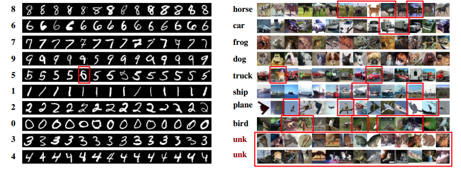
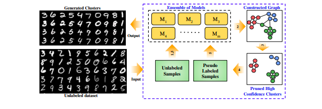

# KingdraCluster - Deep Learning Clustering Implementation

### Official implementation of ICLR 2020 paper Unsupervised Clustering using Pseudo-semi-supervised Learning


 

[Project webpage](https://divamgupta.com/pseudo-semi-supervised-clustering) | [Link to the paper](https://openreview.net/pdf?id=rJlnxkSYPS)

This repository contains the code for "[Unsupervised Clustering using Pseudo-semi-supervised Learning](https://openreview.net/pdf?id=rJlnxkSYPS)"  paper (ICLR 2020) by  **Divam Gupta**, Ramachandran Ramjee, Nipun Kwatra, Muthian Sivathanu

Bibtex:
```
@inproceedings{gupta2019unsupervised,
  title={Unsupervised Clustering using Pseudo-semi-supervised Learning},
  author={Gupta, Divam and Ramjee, Ramachandran and Kwatra, Nipun and Sivathanu, Muthian},
  booktitle={International Conference on Learning Representations},
  year={2019}
}
```


## Abstract 


In this paper, we propose a framework that leverages semi-supervised models to improve unsupervised clustering performance. To leverage semi-supervised models, we first need to automatically generate labels, called pseudo-labels. We find that prior approaches for generating pseudo-labels hurt clustering performance because of their low accuracy. Instead, we use an ensemble of deep networks to construct a similarity graph, from which we extract high accuracy pseudo-labels. The approach of finding high quality pseudo-labels using ensembles and training the semi-supervised model is iterated, yielding continued improvement. We show that our approach outperforms state of the art clustering results for multiple image and text datasets. For example, we achieve 54.6% accuracy for CIFAR-10 and 43.9% for 20news, outperforming state of the art by 8-12% in absolute terms.


## Usage


### Dependencies
* Python 2/3
* Keras 2.1.4
* Tensorflow 1.15.0 
* Sklearn 0.20.4


### Training

```python
from kingdra_cluster.kingdra_cluster import KingdraCluster
model = KingdraCluster()
model.fit( X )
# API documentation coming soon
```


### Evaluating 
```python
from kingdra_cluster.unsup_metrics import ACC
preds = model.predict( X )
ACC( gt  ,  preds )
```


### Reproducing paper results :

```bash
# Download the datasets
wget https://github.com/divamgupta/datasets/releases/download/clustering_datasets/ens_cluster_datasets.zip
unzip ens_cluster_datasets.zip

# train and evaluate on the datasets
python run_exp.py configs/kingdra_ladder_im_mnist.json
python run_exp.py configs/kingdra_ladder_im_20news.json
python run_exp.py configs/kingdra_ladder_im_cifar10.json
python run_exp.py configs/kingdra_ladder_im_reuters.json
python run_exp.py configs/kingdra_ladder_im_stl10.json
```

